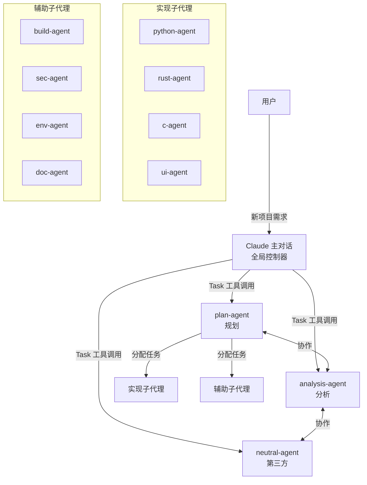
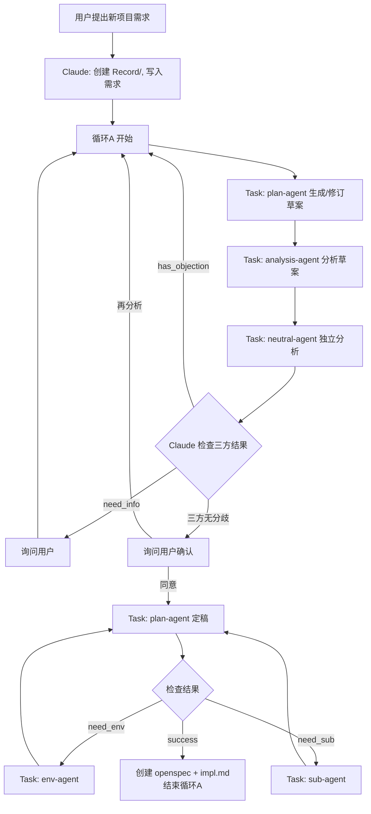
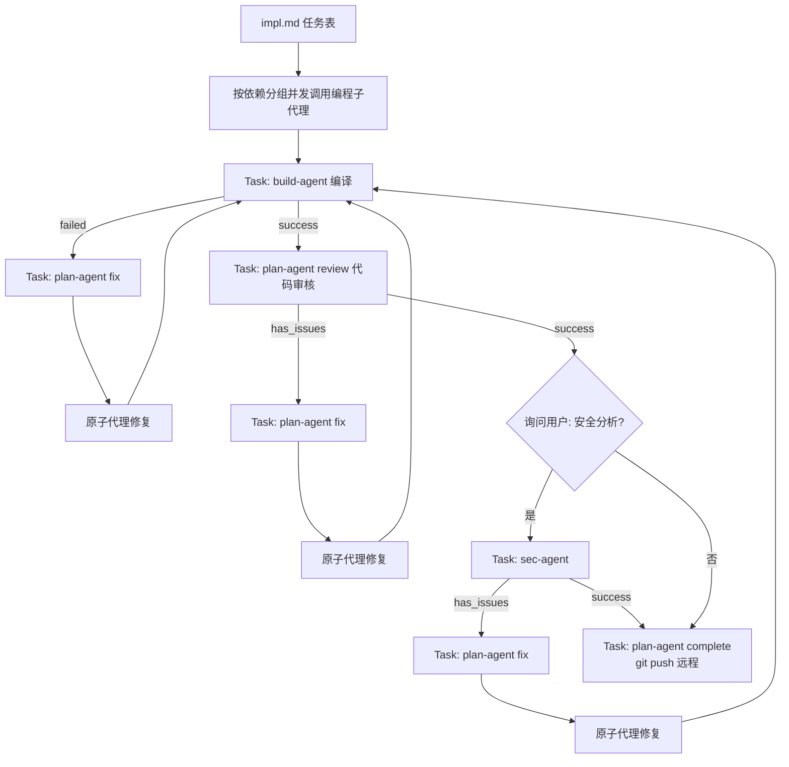
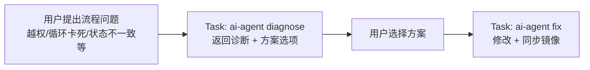

# AI-Synergy

个人使用的全 Claude 子代理协同开发方案。

## 概述

本仓库是"AI协同方案"的全局配置镜像，用于：
- 跨设备迁移AI协同环境
- 版本控制全局配置
- 回滚错误变更

## 架构



### 自动化控制

Claude 主对话作为全局控制器：
- 识别新项目需求，自动创建 Record/ 目录
- 使用 Task 工具调用所有子代理
- 根据子代理返回结果决定下一步操作
- 仅在需要用户输入时暂停询问

### 三方独立思考

plan-agent、analysis-agent、neutral-agent 三个核心子代理：
- 各自独立思考，基于技术事实做判断
- 可以互相否定对方的结论
- 可以否定用户的决定（需写明理由）
- 技术上有严重问题时坚持异议
- **均为固定成员**，每轮讨论都参与

## 双循环工作流

### 循环A（规划阶段 - 自动化）



### 循环B（执行阶段 - 自动化）



### 用户异议处理



## 目录结构

```
ai-synergy/
├── README.md           # 本文件
├── ARCHITECTURE.md     # 架构索引（ai-agent定位用）
├── MANAGED.yaml        # 管理对象白名单
├── PATHS.yaml          # 镜像路径映射
├── CHANGES/            # 变更记录（回滚用）
└── claude/
    ├── CLAUDE.md       # Claude全局指令（主控制逻辑）
    ├── skills/         # Claude skills
    └── agents/         # Claude子代理定义
        ├── plan-agent/       # 规划子代理（含内部skills）
        ├── analysis-agent/   # 分析子代理
        ├── neutral-agent/    # 第三方分析子代理
        ├── python-agent.md   # Python实现
        ├── rust-agent.md     # Rust实现
        ├── c-agent.md        # C语言实现
        ├── ui-agent.md       # 前端UI实现
        ├── doc-agent.md      # 文档更新
        ├── build-agent.md    # 编译构建
        ├── sec-agent.md      # 安全审查
        ├── env-agent.md      # 环境安装
        ├── ai-agent.md       # 全局治理
        └── sub-agent.md      # 子代理管理
```

## 项目 Record 目录结构

每个项目在根目录下创建 `Record/` 目录：

```
项目根目录/
└── Record/
    ├── plan/
    │   ├── draft-plan.md           # 草案（含各方分析章节）
    │   ├── {version}-discussion.md # 归档的讨论记录
    │   └── {version}-final.md      # 确定方案
    ├── Memory/                     # 记忆目录
    │   ├── memory.md               # Claude 主对话记忆
    │   ├── plan-agent.md
    │   ├── analysis-agent.md
    │   ├── neutral-agent.md
    │   └── {slot}.md               # 编程子代理记忆（如 python-agent-01.md）
    ├── env.md                      # 环境安装任务（临时）
    ├── sub.md                      # 子代理创建任务（临时）
    ├── impl.md                     # 实现任务表
    ├── state.json                  # 项目状态机
    └── record.md                   # 事件日志
```

## 快速开始

### 新设备部署

#### 步骤1：克隆仓库

```bash
git clone https://github.com/user-no-found/ai-synergy.git ~/ai-synergy
```

#### 步骤2：创建 ai-agent

只需手动复制一个文件：

```bash
mkdir -p ~/.claude/agents
cp ~/ai-synergy/claude/agents/ai-agent.md ~/.claude/agents/
```

#### 步骤3：启动 ai-agent 完成移植

在 Claude 中启动 ai-agent 子代理，告诉它：

```
请读取 ~/ai-synergy/ 并恢复所有配置到本机
```

ai-agent 会自动：
1. 读取 `ARCHITECTURE.md` 了解架构
2. 读取 `MANAGED.yaml` 获取管理对象清单
3. 读取 `PATHS.yaml` 获取路径映射
4. 输出恢复计划等待你确认
5. 确认后将所有配置恢复到真实位置

#### 步骤4：验证

```bash
# 检查 Claude 配置
ls ~/.claude/agents/
ls ~/.claude/skills/
```

### 日常使用

配置由 `ai-agent` 统一管理：
- 修改配置 → ai-agent 输出变更提案 → 用户确认 → 应用并同步镜像
- 出现问题 → ai-agent 读取 CHANGES/ 执行回滚

## 子代理清单

### 核心规划子代理（循环A）

| 子代理 | 调用方式 | 职责 |
|--------|----------|------|
| plan-agent | Claude Task 调用 | 生成/修订/定稿草案，分配修复，代码审核，归档提交 |
| analysis-agent | Claude Task 调用 | 分析草案，提供技术评估和风险分析 |
| neutral-agent | Claude Task 调用 | 独立分析，提供第三方视角评估 |

### plan-agent 模式

| 模式 | 触发条件 | 职责 |
|------|----------|------|
| `draft` | 循环A | 生成/修订草案 |
| `finalize` | 用户同意草案 | 定稿方案 |
| `fix` | 编译/审核有错误 | 分配修复提案（谁写谁修） |
| `review` | 编译成功 | 代码审核（屎山检查） |
| `complete` | 审核/分析通过 | 归档 + git push（远程） |

### 实现子代理（循环B）

| 子代理 | 调用方式 | 职责 |
|--------|----------|------|
| python-agent | Claude Task 调用 | Python代码实现 |
| rust-agent | Claude Task 调用 | Rust代码实现 |
| c-agent | Claude Task 调用 | C代码实现 |
| ui-agent | Claude Task 调用 | 前端界面/交互实现 |
| doc-agent | Claude Task 调用 | 文档更新 |

### 辅助子代理

| 子代理 | 调用方式 | 职责 |
|--------|----------|------|
| build-agent | Claude Task 调用 | 编译、构建与产物生成 |
| sec-agent | Claude Task 调用 | 安全风险识别、修复建议 |
| env-agent | Claude Task 调用 | 安装项目依赖环境 |
| sub-agent | Claude Task 调用 | 创建/补齐子代理并登记 |
| ai-agent | Claude Task 调用 | 全局治理，处理用户异议 |

### ai-agent 模式

| 模式 | 触发条件 | 职责 |
|------|----------|------|
| `diagnose` | 用户提出流程问题 | 诊断问题，输出修改方案 |
| `fix` | 用户选择方案后 | 执行修改，同步镜像 |
| `audit` | 定期检查或用户要求 | 审计配置一致性 |

## 独立思考原则

所有子代理都遵循独立思考原则：

```
- 【必须独立判断】基于技术事实做独立评估
- 【可以否定用户】即使是用户的决定也可以提出异议
- 【可以否定其他子代理】对其他子代理的结论可以提出异议
- 【写明理由】所有否定意见必须写明具体原因和潜在风险
- 【不盲从】不因任何一方说的就无条件接受
- 【建设性】否定时应提供替代方案或改进建议
- 【坚持原则】技术上有严重问题时，即使多方都催促也要坚持异议
```

## 核心规则

### Git 操作规则

| 阶段 | 操作 | 范围 |
|------|------|------|
| 编程子代理完成 | git commit | 本地 |
| 修复子代理完成 | git commit | 本地 |
| plan-agent (complete) | git push | **远程**（唯一） |

### 其他规则

- **禁止 AI 署名**：git commit 禁止添加 Co-Authored-By 等
- **冲突预防**：proposal 中的 `allowed_paths` 确保文件排他
- **变更门禁**：ai-agent 修改前必须输出提案并等待用户确认
- **sudo 规则**：env-agent 禁止自动执行 sudo，必须返回让用户手动执行
- **质量门禁**：sub-agent 创建的子代理必须通过质量门禁（>=24/32）

## 回滚

如果配置出现问题：

```
1. 让 ai-agent 读取 ~/ai-synergy/CHANGES/{timestamp}-{change_id}/
2. 执行 rollback.md 中的回滚步骤
3. 或直接从镜像恢复：cp ~/ai-synergy/claude/... ~/.claude/...
```

## 致谢

- [vibe-coding-cn](https://github.com/2025Emma/vibe-coding-cn) - 质量门禁、八荣八耻等开发理念参考

## License

MIT
